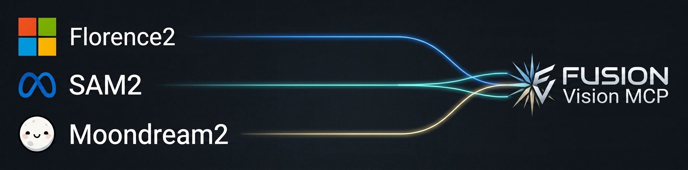

# FusionVisionMCP: Supercharge Your AI With Vision Powers 🚀

[](https://github.com/Whoawhen/FusionVisionMCP/blob/main/LICENSE)
[](https://github.com/astral-sh/uv)
[](https://github.com/Whoawhen/FusionVisionMCP/actions/workflows/python-app.yaml)
[](https://github.com/pre-commit/pre-commit)

**Transform any AI assistant into a visual genius with 10 cutting-edge computer vision tools**



While other vision tools offer basic OCR or simple captioning, FusionVisionMCP delivers comprehensive visual intelligence that rivals specialized computer vision systems—all in a single, easy-to-use package.

---

> **Quick Navigation**
>
> [Get Started](#get-started-in-seconds) | [Powerful Tools](#powerful-computer-vision-tools) | [Real-World Examples](#real-world-examples) | [Installation](#installation)

---

## Get Started in Seconds

**Step 1: Download the latest release**

Download the latest MCP bundle `fusion-vision-mcp.mcpb` from our [Releases](https://github.com/Whoawhen/FusionVisionMCP/releases) page.

**Step 2: Install with one click**

Open the downloaded `.mcpb` file or drag it into Claude Desktop's Settings window.

That's it! FusionVisionMCP is now available in your AI assistant.

### Works With Your Favorite AI Tools

- **Claude Desktop** - Native integration with one-click setup
- **Cursor / Windsurf / VS Code** - Connect via MCP configuration
- **Any MCP-compatible client** - Universal compatibility

---

## Powerful Computer Vision Tools

With ten specialized tools, FusionVisionMCP handles any visual task:

### 🔍 Text Extraction & Understanding
Extract text from any image, document, or screenshot with industry-leading accuracy.

### 📝 Intelligent Image Captioning
Generate rich, contextual descriptions that capture the essence of complex visuals.

### 🎯 Object Detection & Pointing
Locate specific objects with precise bounding boxes or center coordinates.

### ❓ Visual Question Answering
Ask open-ended questions about images and get detailed, accurate answers.

### 🧭 Spatial Relationship Analysis
Understand how objects relate physically—whether they touch, contain, or overlap each other.

### 📊 Dense Region Captioning
Automatically caption every important region in complex images.

### ⚡ Batch Processing
Process multiple images simultaneously for large-scale analysis.

### 🔧 Custom Prompt Processing
Run specialized Florence-2 prompts for unique use cases.

### 🔄 Smart Analysis Router
Automatically selects the best tool for each task.

## Installation

### Claude Desktop (Recommended)
1. Download the latest MCP bundle `fusion-vision-mcp.mcpb` from [Releases](https://github.com/Whoawhen/FusionVisionMCP/releases)
2. Open the downloaded `.mcpb` file or drag it into Claude Desktop's Settings window

### Manual Installation
For advanced users or custom setups:

#### Prerequisites
- Python 3.10+
- Git
- 8GB+ RAM recommended

#### Setup Steps
```bash
git clone https://github.com/Whoawhen/FusionVisionMCP.git
cd FusionVisionMCP
pip install -e .
```

#### Configuration
Add to your MCP client configuration:
```json
{
  "mcpServers": {
    "fusionvision": {
      "command": "uv",
      "args": ["run", "fusionvision-mcp"]
    }
  }
}
```

---

## System Requirements

- **RAM**: 8GB minimum (16GB+ recommended)
- **Storage**: 15GB free space for model weights
- **OS**: Windows 10+, macOS 12+, or Linux
- **Internet**: Required for initial model download

Models are automatically downloaded on first use and cached locally for offline operation.

---

## Real-World Examples

### Document Processing
Turn receipts, contracts, and forms into searchable text instantly.

### Product Analysis
Examine product photos to extract specifications, compare features, and answer questions.

### Technical Diagrams
Understand flowcharts, schematics, and architectural diagrams by asking specific questions.

### Quality Control
Verify that components are properly assembled by analyzing spatial relationships.

### Educational Content
Extract equations, diagrams, and illustrations from textbooks and academic papers.

### Social Media Analysis
Process screenshots and memes to understand context and sentiment.

---

## Why FusionVisionMCP?

Most AI vision tools are limited to basic OCR or simple image descriptions. FusionVisionMCP goes far beyond:

| Feature | Basic Vision Tools | FusionVisionMCP |
|---------|-------------------|------------------|
| Image Understanding | ✅ Basic OCR & Captioning | ✅ Advanced Spatial Analysis |
| Object Detection | ❌ | ✅ Precise Bounding Boxes |
| Visual Question Answering | ❌ | ✅ Open-Ended Insights |
| Spatial Reasoning | ❌ | ✅ Touch, Containment, Distance |
| Memory Efficiency | ❌ | ✅ Automatic Model Management |
| Multi-Model Integration | ❌ | ✅ Florence-2, Moondream2, SAM2 |
| Hardware Flexibility | Limited | ✅ CPU/GPU Adaptive Processing |
| Resource Optimization | ❌ | ✅ GPU Conservation for Primary AI Tasks |

## Advanced Tool Comparison

Understanding the differences between vision tools helps you choose the right solution for your needs:

| Tool Name | Provider | Core Functions | Unique Advantages |
|-----------|----------|----------------|-------------------|
| **Florence-2** | Microsoft (Original) | `ocr`, `caption`, `process` | Efficient for basic OCR and captioning |
| **FusionVisionMCP** | Whoawhen | `ocr`, `caption`, `process`, `detect_objects`, `point_objects`, `dense_region_caption`, `query_image`, `spatial_relations`, `analyze_image`, `batch_analyze_images` | Comprehensive vision analysis with spatial reasoning |
| **Moondream2** | Vikhyat | `query_image` (Visual QA) | Specialized for open-ended visual question answering |

### FusionVisionMCP's Novel Functions

FusionVisionMCP introduces several advanced capabilities beyond the original Florence-2:

- **`spatial_relations`** - Measures how objects relate spatially (touch, containment, distance) using SAM2 segmentation
- **`query_image`** - Ask open-ended questions about images with Moondream2
- **`detect_objects` & `point_objects`** - Enhanced object detection with precise coordinates
- **`dense_region_caption`** - Automatic captioning of all salient regions
- **`analyze_image` & `batch_analyze_images`** - Multi-purpose tools for flexible processing

### Need More Technical Details?

See our [complete technical documentation](README_DETAILED.md) for full API specifications, tool arguments, and advanced configuration options.

---

## Technical Architecture

FusionVisionMCP integrates three state-of-the-art computer vision models into one MCP server:

- **Microsoft Florence-2**: Foundation model for captioning, OCR, and object detection
- **Moondream2**: Specialized for open-ended visual question answering
- **SAM2 (Segment Anything Model 2)**: Advanced segmentation for spatial reasoning

Each model loads on-demand and unloads automatically to conserve memory, ensuring optimal performance.

Fork of [jkawamoto/mcp-florence2](https://github.com/jkawamoto/mcp-florence2), which provides exactly three tools —
`ocr`, `caption`, `process` — all against Florence-2.

---

## Hardware Flexibility & Resource Optimization

FusionVisionMCP is designed to run efficiently across multiple hardware configurations:

### Multi-Hardware Support
- **CPU-Only Systems** - Optimized to run on capable CPUs with sufficient system memory
- **GPU-Accelerated Systems** - Leverages GPUs for faster processing when available
- **Hybrid Configurations** - Intelligently distributes workload based on system capabilities

### Resource Optimization Benefits
- **GPU Conservation** - Offloads token-intensive computer vision tasks to local processing, freeing up valuable GPU resources for primary AI workloads
- **Scalable Performance** - Adapts to available hardware without requiring dedicated high-end GPUs
- **Memory Management** - Automatic model loading/unloading conserves system resources during inactive periods
- **Cost-Effective Deployment** - Reduces dependency on expensive cloud GPU instances for routine vision tasks

This design philosophy ensures that FusionVisionMCP enhances your AI workflow without competing for critical computational resources.

---

## License

This project is licensed under the MIT License - see the [LICENSE](LICENSE) file for details.
